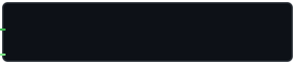

  
  
<i>Full‑Stack SWE • builder</i>

  

    
    
    
    
    
    
    
  

 

   

  &nbsp;
  &nbsp;
  &nbsp;
  &nbsp;
  &nbsp;
  

---

### About me

I'm a full‑stack software engineer who enjoys building and scaling applications, solving complex problems, and understanding systems end‑to‑end—especially how thoughtful design can impact millions of users. I also interned at American Express in Global Network Services, where I built an AI root-cause analysis tool for high-throughput payment systems. I previously interned at DriveTime (Summer 2025) on the Bridgecrest loan platform and led full‑stack development for the [ASU BAP](https://www.asubap.com/) platform, a Canvas‑style replacement powering member onboarding, admin operations, event management with GPS check‑ins, sponsor/member search, and resource management.

When I'm not shipping code, I'm at the gym or reading manga.

If you'd like to connect or collaborate, email me at <b>kurseashish3@gmail.com</b>.

---

### Highlights

  
  &nbsp;&nbsp;&nbsp;&nbsp;
  

- **American Express – Software Engineering Intern, Global Network Services (Summer 2026)**
  - Built an AI root-cause analysis tool for 5+ developer teams supporting a payment network handling up to 6,000 transactions/second; correlating Confluence, Jira/Rally, and GitHub context with live Kibana logs and Prometheus metrics cutting manual cross-tool triage time by 90% 

- **DriveTime – Full‑Stack SWE Intern (Summer 2025)**
  - Contributed to Bridgecrest’s payments/loan systems: end‑to‑end service + database changes, GraphQL federation (Hot Chocolate), and stored procedure optimizations for high‑throughput workloads.
  - Owned CI/CD flows in Azure DevOps and monitored rollouts with Datadog for safe, observable releases.

- **ASU BAP – Lead Full‑Stack Engineer** — <a href="https://www.asubap.com/" target="_blank">live</a> • <a href="https://www.youtube.com/watch?v=iScyFMEi-Ow" target="_blank">video demo</a>
  - Built and deployed a Canvas‑style member operations platform used by 300+ members and sponsors (IRS, Honeywell, KPMG, Deloitte, EY, PwC), centralizing onboarding, events, and resources with React/TypeScript, Express/TypeScript, Supabase, and Vercel.
  - Implemented RBAC, GPS‑based event attendance, RSVP tracking, SendGrid bulk email with dynamic templates, Supabase cron jobs, search (Fuse.js), and resource management.

---

### Tech stack

#### Languages

  
  
  
  
  
  
  
  
  
  

#### Frameworks & Libraries

  
  
  
  
  
  
  
  
  
  
  
  
  
  
  
  

#### Data, AI & APIs

  
  
  
  
  
  
  
  
  
  
  
  
  
  

#### Developer Tools

  
  
  
  
  
  
  
  
  
  
  
  
  
  
  
  
  

---

### Featured projects

- <b>Multimodal Search</b> — <a href="https://github.com/ashcodex505/Multimodal_Search" target="_blank">repo</a>
  - Built a local-first macOS app that searches images, PDFs, and videos from natural-language descriptions using Gemini multimodal embeddings and ChromaDB vector search, with incremental indexing that skips unchanged files.
  - Developed a FastAPI dashboard with ranked results, previews, file-type filters, and an interactive similarity map; made the same search workflow available through Raycast, the CLI, and a native macOS launcher.

- <b>I Want_ (SunHacks Fall '24 – 3rd place, 1300+ participants)</b> — <a href="https://github.com/ashcodex505/I_Want" target="_blank">repo</a>
  - Built a meal-discovery app that recommends nearby restaurant dishes based on a user’s macro goals and location, helping users find nutrition-aligned options in seconds.
  - Redis‑backed caching for faster restaurant queries, Flask APIs for retrieval/filtering, React + MUI UI, Google Maps/Places integration, AWS Textract for nutrition extraction, Supabase for storage, Vercel deployment.
 
- <b>TAMID Tech Blog</b> — <a href="https://tamid-tech-blog-challenge.vercel.app/" target="_blank">live</a> • <a href="https://github.com/ashcodex505/TAMID-Tech-Blog-Challenge" target="_blank">repo</a>
  - Full‑stack TypeScript blog platform (React + Express) with Supabase Auth and Object Storage.
  - Create public or private posts with dynamic tag categories and attach up to 5 images per post.
  - Responsive UI, image upload with previews, and protected routes.

- <b>TAMID ASU Website</b> — <a href="https://tamid-asu-website-kappa.vercel.app/" target="_blank">live</a> • <a href="https://github.com/ashcodex505/tamid-asu-website" target="_blank">repo</a>
  - Engagement/landing site for TAMID ASU built to boost visibility and member interest.
  - Modern, responsive design highlighting programs, tracks, and involvement opportunities.

- <b>IronGraph (gym-git)</b> — <a href="https://github.com/ashcodex505/gym-git" target="_blank">repo</a>
  - Git-native workout tracker that turns free-form GitHub Issues into validated, human-authored workout commits and regenerates PRs, streaks, XP, charts, an exercise graph, and animated per-muscle pixel art.

---

### Connect

- Email: <a href="mailto:kurseashish3@gmail.com">kurseashish3@gmail.com</a>
- LinkedIn: <a href="https://www.linkedin.com/in/ashish-kurse" target="_blank">/in/ashish-kurse</a>
- YouTube: <a href="https://www.youtube.com/@Ash_Codex/shorts" target="_blank">@Ash_Codex</a>

---
